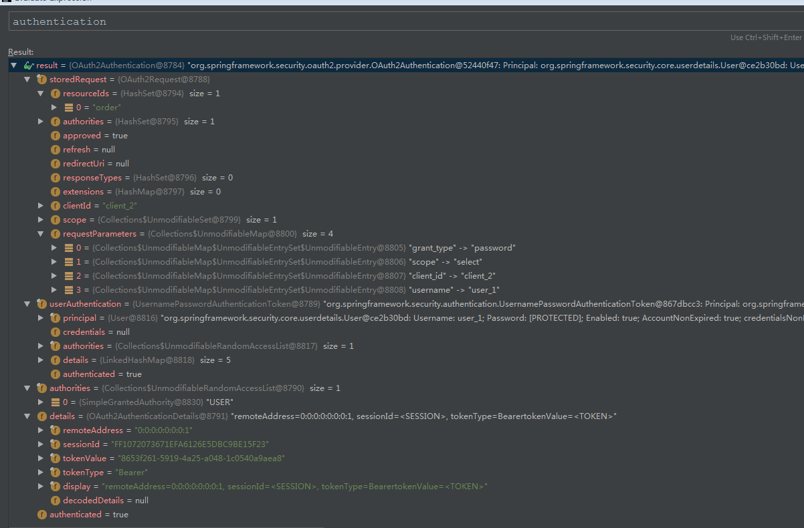
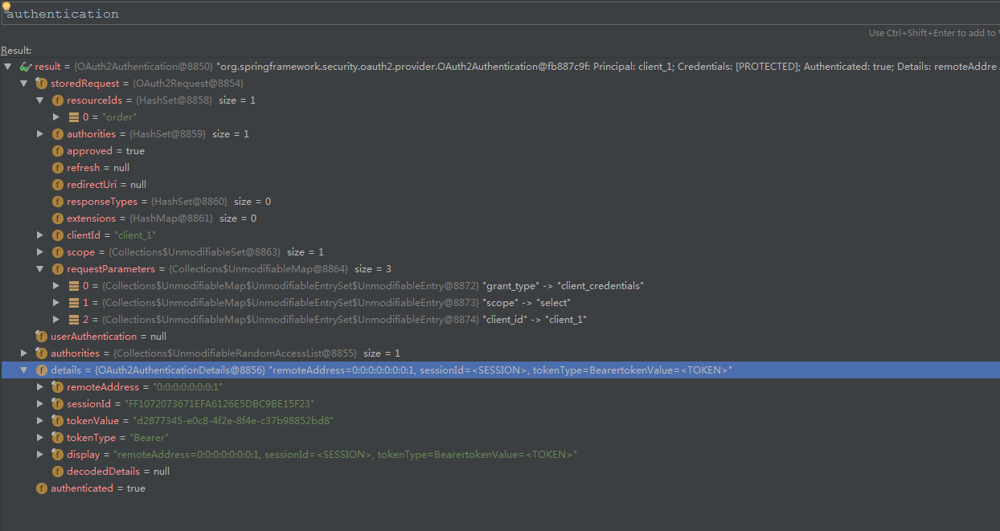
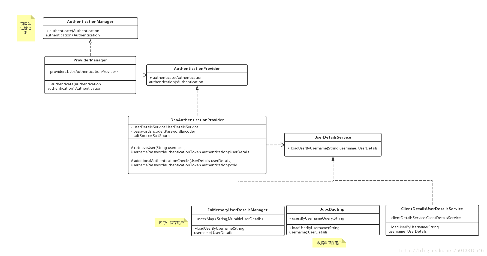
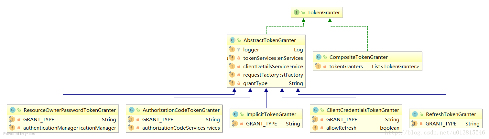
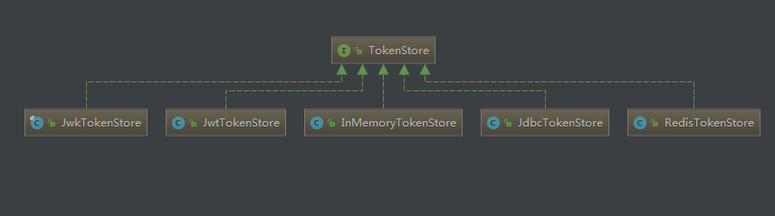
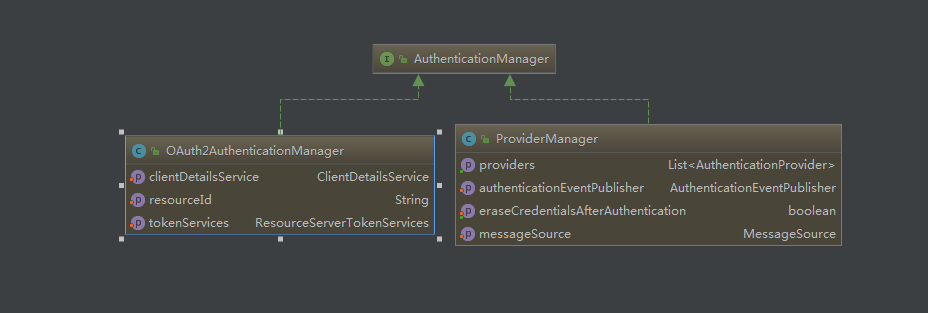

### 相关配置
- 配置 授权服务器 AuthorizationServerConfiguration 
- 配置 资源服务器 ResourceServerConfiguration
- web 安全相关配置 SecurityConfiguration

### 实验步骤
- 启动 redis 服务
- postman 访问  


#### password模式：
> 自己本身有一套用户体系，在认证时需要带上自己的用户名和密码，
以及客户端的client_id,client_secret。此时，accessToken 所包含的权限是用户本身的权限，
而不是客户端的权限。

````
http://localhost:9081/oauth/token?username=user_1&password=123456&grant_type=password&scope=select&client_id=client_2&client_secret=123456

{
    "access_token": "8653f261-5919-4a25-a048-1c0540a9aea8",
    "token_type": "bearer",
    "refresh_token": "0c3852c5-6ae8-4f58-a8d0-30682d91a0e9",
    "expires_in": 43199,
    "scope": "select"
}
````

#### client模式： 
> 没有用户的概念，直接与认证服务器交互，用配置中的客户端信息去申请accessToken,
用配置中的客户端信息去申请accessToken，客户端有自己的client_id,client_secret对应于用户的username,password，
而客户端也拥有自己的 authorities，当采取client模式认证时，对应的权限也就是客户端自己的authorities。

````
http://localhost:9081/oauth/token?grant_type=client_credentials&scope=select&client_id=client_1&client_secret=123456

{
    "access_token": "d2877345-e0c8-4f2e-8f4e-c37b98852bd8",
    "token_type": "bearer",
    "expires_in": 43199,
    "scope": "select"
}
````

#### 直接访问 http://localhost:9081/order/
````
{
    "error": "unauthorized",
    "error_description": "Full authentication is required to access this resource"
}
````

#### 使用password模式获得的token: 
http://localhost:9081/order/1?access_token=8653f261-5919-4a25-a048-1c0540a9aea8 




#### 使用client模式获得的token: 
http://localhost:9081/order/1?access_token=d2877345-e0c8-4f2e-8f4e-c37b98852bd8 




#### 可以直接访问 http://localhost:9081/product/1
```
product id : 1
```

---

### 源码分析

#### 客户端身份认证核心过滤器ClientCredentialsTokenEndpointFilter（掌握）
在请求到达/oauth/token之前经过了ClientCredentialsTokenEndpointFilter这个过滤器
````
public Authentication attemptAuthentication(HttpServletRequest request, HttpServletResponse response)
        throws AuthenticationException, IOException, ServletException {
    ...
    String clientId = request.getParameter("client_id");
    String clientSecret = request.getParameter("client_secret");

    ...
    clientId = clientId.trim();
    UsernamePasswordAuthenticationToken authRequest = new UsernamePasswordAuthenticationToken(clientId,
            clientSecret);

    return this.getAuthenticationManager().authenticate(authRequest);

}
````

#### 顶级身份管理者 AuthenticationManager（掌握）
用来从请求中获取client_id,client_secret，组装成一个UsernamePasswordAuthenticationToken作为身份标识，
使用容器中的顶级身份管理器AuthenticationManager去进行身份认证（AuthenticationManager的实现类一般是ProviderManager。
而ProviderManager内部维护了一个List,真正的身份认证是由一系列 AuthenticationProvider 去完成。
而 AuthenticationProvider 的常用实现类则是 DaoAuthenticationProvider 

DaoAuthenticationProvider内部又聚合了一个 UserDetailsService接口，**UserDetailsService才是获取用户详细信息的最终接口**，
而在内存中配置用户，就是使用了 UserDetailsService 的一个实现类 InMemoryUserDetailsManager）   



#### client模式是不存在“用户”的概念的，那么这里的身份认证是在认证什么呢?
debug可以发现 UserDetailsService 的实现被适配成了 ClientDetailsUserDetailsService，
这个设计是将client客户端的信息（client_id,client_secret）
适配成用户的信息(username,password)，这样我们的认证流程就不需要修改了    

经过ClientCredentialsTokenEndpointFilter之后，身份信息已经得到了AuthenticationManager的验证。接着便到达了 
TokenEndpoint。  


#### Token处理端点TokenEndpoint（掌握）
> 两个 ClientCredentialsTokenEndpointFilter 和 AuthenticationManager可以理解为一些前置校验，和身份封装

````
@FrameworkEndpoint
public class TokenEndpoint extends AbstractEndpoint {

    @RequestMapping(value = "/oauth/token", method=RequestMethod.POST)
    public ResponseEntity<OAuth2AccessToken> postAccessToken(Principal principal, @RequestParam
    Map<String, String> parameters) throws HttpRequestMethodNotSupportedException {
         ...
        String clientId = getClientId(principal);// 获取客户 id
        
        // 根据 客户端id 获取 客户端详情
        ClientDetails authenticatedClient = getClientDetailsService().loadClientByClientId(clientId);//<1>
        ...
        TokenRequest tokenRequest = getOAuth2RequestFactory().createTokenRequest(parameters, authenticatedClient);//<2>
        ...
        OAuth2AccessToken token = getTokenGranter().grant(tokenRequest.getGrantType(), tokenRequest);//<3>
        ...
        return getResponse(token);

    }

    private TokenGranter tokenGranter;
}
````

- <1> 加载客户端信息
- <2> 结合请求信息，创建TokenRequest
- <3> 将TokenRequest传递给TokenGranter颁发token

真正的/oauth/token端点暴露在了我们眼前，其中方法参数中的 Principal 经过之前的过滤器，
已经被填充了相关的信息，而方法的内部则是依赖了一个 TokenGranter 来颁发token。 

其中 OAuth2AccessToken 的实现类 DefaultOAuth2AccessToken 就是最终在控制台得到的 token序列化之前的原始类:

##### 一个典型的样例token响应,如下所示，就是上述类序列化后的结果
````
{
    "access_token": "8653f261-5919-4a25-a048-1c0540a9aea8",
    "token_type": "bearer",
    "refresh_token": "0c3852c5-6ae8-4f58-a8d0-30682d91a0e9",
    "expires_in": 43199,
    "scope": "select"
}
````

#### TokenGranter（掌握）



TokenGranter 的设计思路是使用 CompositeTokenGranter 管理一个List列表，
每一种 grantType 对应一个具体的真正授权者，在debug过程中可以发现 CompositeTokenGranter 
内部就是在循环调用五种TokenGranter实现类的grant方法，而 granter 内部则是通过 grantType 来区分是否是各自的授权类型。

````
public class CompositeTokenGranter implements TokenGranter {

    private final List<TokenGranter> tokenGranters;

    public CompositeTokenGranter(List<TokenGranter> tokenGranters) {
        this.tokenGranters = new ArrayList<TokenGranter>(tokenGranters);
    }

    public OAuth2AccessToken grant(String grantType, TokenRequest tokenRequest) {
        // 循环 token 的颁发者
        for (TokenGranter granter : tokenGranters) {
            OAuth2AccessToken grant = granter.grant(grantType, tokenRequest);
            if (grant!=null) {
                return grant;
            }
        }
        return null;
    }
}
````

##### 五种类型分别是：
- ResourceOwnerPasswordTokenGranter ==> password密码模式
- AuthorizationCodeTokenGranter ==> authorization_code授权码模式
- ClientCredentialsTokenGranter ==> client_credentials客户端模式
- ImplicitTokenGranter ==> implicit简化模式
- RefreshTokenGranter ==>refresh_token 刷新token专用

#### 以客户端模式为例，思考如何产生token的?
````
public abstract class AbstractTokenGranter implements TokenGranter {

    protected final Log logger = LogFactory.getLog(getClass());

    //与token相关的service，重点
    private final AuthorizationServerTokenServices tokenServices;
    //与clientDetails相关的service，重点
    private final ClientDetailsService clientDetailsService;
    //创建oauth2Request的工厂，重点
    private final OAuth2RequestFactory requestFactory;

    private final String grantType;
    ...

    public OAuth2AccessToken grant(String grantType, TokenRequest tokenRequest) {

        ...
        String clientId = tokenRequest.getClientId();
        ClientDetails client = clientDetailsService.loadClientByClientId(clientId);
        validateGrantType(grantType, client);

        logger.debug("Getting access token for: " + clientId);

        return getAccessToken(client, tokenRequest);

    }

    protected OAuth2AccessToken getAccessToken(ClientDetails client, TokenRequest tokenRequest) {
        return tokenServices.createAccessToken(getOAuth2Authentication(client, tokenRequest));
    }

    protected OAuth2Authentication getOAuth2Authentication(ClientDetails client, TokenRequest tokenRequest) {
        OAuth2Request storedOAuth2Request = requestFactory.createOAuth2Request(client, tokenRequest);
        return new OAuth2Authentication(storedOAuth2Request, null);
    }

    ...
}
````

回过头去看 TokenEndpoint中，正是调用了这里的三个重要的类变量的相关方法.

#### AuthorizationServerTokenServices（了解）
````
public interface AuthorizationServerTokenServices {
    //创建token
    OAuth2AccessToken createAccessToken(OAuth2Authentication authentication) throws AuthenticationException;
    
    //刷新token
    OAuth2AccessToken refreshAccessToken(String refreshToken, TokenRequest tokenRequest)
            throws AuthenticationException;
    
    //获取token
    OAuth2AccessToken getAccessToken(OAuth2Authentication authentication);

}
````

在默认的实现类 DefaultTokenServices 中，可以看到token是如何产生的，并且了解了框架对token进行哪些信息的关联
````
    @Transactional
	public OAuth2AccessToken createAccessToken(OAuth2Authentication authentication) throws AuthenticationException {
        // 获取 已存在的token
		OAuth2AccessToken existingAccessToken = tokenStore.getAccessToken(authentication);
		OAuth2RefreshToken refreshToken = null;
		if (existingAccessToken != null) {
		    // token 是否已过期
			if (existingAccessToken.isExpired()) {
				if (existingAccessToken.getRefreshToken() != null) {
					refreshToken = existingAccessToken.getRefreshToken();
					// The token store could remove the refresh token when the
					// access token is removed, but we want to
					// be sure...
					tokenStore.removeRefreshToken(refreshToken);
				}
				tokenStore.removeAccessToken(existingAccessToken);
			}
			else {
				// Re-store the access token in case the authentication has changed
				tokenStore.storeAccessToken(existingAccessToken, authentication);
				return existingAccessToken;
			}
		}

	    // 创建刷新 token
		if (refreshToken == null) {
			refreshToken = createRefreshToken(authentication);
		}
		
		else if (refreshToken instanceof ExpiringOAuth2RefreshToken) {
			ExpiringOAuth2RefreshToken expiring = (ExpiringOAuth2RefreshToken) refreshToken;
			// 刷新 token　是否已过期
			if (System.currentTimeMillis() > expiring.getExpiration().getTime()) {
				refreshToken = createRefreshToken(authentication);
			}
		}

        // 创建 token
		OAuth2AccessToken accessToken = createAccessToken(authentication, refreshToken);
        // 存储 token
		tokenStore.storeAccessToken(accessToken, authentication);

		refreshToken = accessToken.getRefreshToken();
		
		// 刷新 token 存在，则存储起来
		if (refreshToken != null) {
			tokenStore.storeRefreshToken(refreshToken, authentication);
		}
		
		return accessToken;

	}
````

简单总结一下AuthorizationServerTokenServices的作用，
他提供了创建token，刷新token，获取token的实现。在创建token时，
他会调用 tokenStore 对产生的token和相关信息存储到对应的实现类中.




#### 总结：以上分析了 身份认证 ====>> token 的端点的 授权类型、生成、获取、存储 等流程

#### 分析 携带token访问受限资源时，内部的工作流程
> 分析的携带token访问受限资源，自然便是与@EnableResourceServer相关的资源服务器配置了

配置类是 ResourceServerConfigurer，
内部关联了 ResourceServerSecurityConfigurer 和 HttpSecurity。前者与资源安全配置相关，后者与http安全配置相关

> 以Adapter结尾的是适配器，以Configurer结尾的是配置器，以Builder结尾的是建造器

````
public class ResourceServerConfigurerAdapter implements ResourceServerConfigurer {

    @Override
    public void configure(ResourceServerSecurityConfigurer resources <1> ) throws Exception {
    }

    @Override
    public void configure(HttpSecurity http) throws Exception {
        http.authorizeRequests().anyRequest().authenticated();
    }

}
````

#### ResourceServerSecurityConfigurer（了解）

这段是整个oauth2与HttpSecurity相关的核心配置

````
@Override
	public void configure(HttpSecurity http) throws Exception {

		AuthenticationManager oauthAuthenticationManager = oauthAuthenticationManager(http);
		
		// 创建 OAuth2AuthenticationProcessingFilter，即 Auth2核心过滤器
		resourcesServerFilter = new OAuth2AuthenticationProcessingFilter();
		
		resourcesServerFilter.setAuthenticationEntryPoint(authenticationEntryPoint);
		
		// 为 OAuth2AuthenticationProcessingFilter 提供固定的 AuthenticationManager 即 OAuth2AuthenticationManager
		//，它并没有将OAuth2AuthenticationManager添加到spring的容器中，不然可能会影响spring security的普通认证流程（非oauth2请求）
		//，只有被 OAuth2AuthenticationProcessingFilter 拦截到的 oauth2 相关请求 才被特殊的身份认证器处理。
		resourcesServerFilter.setAuthenticationManager(oauthAuthenticationManager);
		
		if (eventPublisher != null) {
			resourcesServerFilter.setAuthenticationEventPublisher(eventPublisher);
		}
		
		// 设置了 TokenExtractor 默认的实现 BearerTokenExtractor
		if (tokenExtractor != null) {
			resourcesServerFilter.setTokenExtractor(tokenExtractor);
		}
		if (authenticationDetailsSource != null) {
			resourcesServerFilter.setAuthenticationDetailsSource(authenticationDetailsSource);
		}
		resourcesServerFilter = postProcess(resourcesServerFilter);
		resourcesServerFilter.setStateless(stateless);

		// @formatter:off
		http
			.authorizeRequests().expressionHandler(expressionHandler)
		.and()
			.addFilterBefore(resourcesServerFilter, AbstractPreAuthenticatedProcessingFilter.class)
			.exceptionHandling()
			    // 相关的异常处理器，可以重写相关实现，达到自定义异常的目的。
				.accessDeniedHandler(accessDeniedHandler)
				.authenticationEntryPoint(authenticationEntryPoint);
		// @formatter:on
	}
````

#### 核心过滤器 OAuth2AuthenticationProcessingFilter（掌握）

- 如何携带token访问受限资源的? 

http://localhost:9081/order/1?access_token=d2877345-e0c8-4f2e-8f4e-c37b98852bd8 
 
唯一的身份凭证，便是这个 access_token，携带它进行访问，
会进入 OAuth2AuthenticationProcessingFilter 之中，其核心代码如下：

````
public void doFilter(ServletRequest req, ServletResponse res, FilterChain chain){

    final HttpServletRequest request = (HttpServletRequest) req;
    final HttpServletResponse response = (HttpServletResponse) res;

    try {
        //从请求中取出身份信息，即access_token
        Authentication authentication = tokenExtractor.extract(request);

        if (authentication == null) {
            ...
        }
        else {
          
            // 在当前请求域中添加 token value
            request.setAttribute(OAuth2AuthenticationDetails.ACCESS_TOKEN_VALUE, authentication.getPrincipal());
            if (authentication instanceof AbstractAuthenticationToken) {
                AbstractAuthenticationToken needsDetails = (AbstractAuthenticationToken) authentication;
                needsDetails.setDetails(authenticationDetailsSource.buildDetails(request));
            }
            
            //认证身份
            Authentication authResult = authenticationManager.authenticate(authentication);
            ...
            eventPublisher.publishAuthenticationSuccess(authResult);
            
            //将身份信息绑定到SecurityContextHolder中
            SecurityContextHolder.getContext().setAuthentication(authResult);
        }
    }
    catch (OAuth2Exception failed) {
        ...
        return;
    }

    chain.doFilter(request, response);
}
````

整个过滤器便是oauth2身份鉴定的关键。
OAuth2 保护资源的 预先认证过滤器。如果与 OAuth2AuthenticationManager 结合使用，
则会从到来的请求之中提取一个 OAuth2 token，之后使用 OAuth2Authentication 来填充 Spring Security上下文。


#### OAuth2的身份管理器 OAuth2AuthenticationManager（掌握）
携带 access_token 必定得经过身份认证，AuthenticationManager 的实现类并不是我们在前面文章中聊到的常用实现类 ProviderManager，
而是 OAuth2AuthenticationManager。



OAuth2AuthenticationManager它直接重写了容器的顶级身份认证接口，
内部维护了一个 ClientDetailService 和 ResourceServerTokenServices,
这里要强调的是 OAuth2AuthenticationManager 是密切与token认证相关的，而不是与获取token密切相关的。

OAuth2AuthenticationManager 类中 判别身份的关键代码如下：
````
public Authentication authenticate(Authentication authentication) throws AuthenticationException {

    ...
    String token = (String) authentication.getPrincipal();
    
    //最终还是借助 tokenServices 根据token 加载身份信息
    OAuth2Authentication auth = tokenServices.loadAuthentication(token);
    ...

    checkClientDetails(auth);

    if (authentication.getDetails() instanceof OAuth2AuthenticationDetails) {
        OAuth2AuthenticationDetails details = (OAuth2AuthenticationDetails) authentication.getDetails();
        ...
    }
    auth.setDetails(authentication.getDetails());
    auth.setAuthenticated(true);
    return auth;

}

````
说到tokenServices(有多种实现)这个密切与token相关的接口，这里要强调下，避免产生误解。tokenServices分为两类，

一个是用在 AuthenticationServer 授权端
````
public interface AuthorizationServerTokenServices {
    //创建token
    OAuth2AccessToken createAccessToken(OAuth2Authentication authentication) throws AuthenticationException;
    //刷新token
    OAuth2AccessToken refreshAccessToken(String refreshToken, TokenRequest tokenRequest)
            throws AuthenticationException;
    //获取token
    OAuth2AccessToken getAccessToken(OAuth2Authentication authentication);
}
````

第二个是 ResourceServer 资源端也有自己的 tokenServices 接口
````
public interface ResourceServerTokenServices {

    //根据 accessToken 加载客户端信息
    OAuth2Authentication loadAuthentication(String accessToken) throws AuthenticationException, InvalidTokenException;

    //根据 accessToken 获取完整的访问令牌详细信息。
    OAuth2AccessToken readAccessToken(String accessToken);

}
````

#### TokenExtractor（了解）
````
public class BearerTokenExtractor implements TokenExtractor {

    private final static Log logger = LogFactory.getLog(BearerTokenExtractor.class);

    @Override
    public Authentication extract(HttpServletRequest request) {
        String tokenValue = extractToken(request);
        if (tokenValue != null) {
            PreAuthenticatedAuthenticationToken authentication = new PreAuthenticatedAuthenticationToken(tokenValue, "");
            return authentication;
        }
        return null;
    }

   	protected String extractToken(HttpServletRequest request) {
   		// 从请求头 提取 token
   		String token = extractHeaderToken(request);
   
   		// bearer type allows a request parameter as well
   		if (token == null) {
   			logger.debug("Token not found in headers. Trying request parameters.");
   			
   			// 从请求参数 提取 token 
   			token = request.getParameter(OAuth2AccessToken.ACCESS_TOKEN);
   			if (token == null) {
   				logger.debug("Token not found in request parameters.  Not an OAuth2 request.");
   			}
   			else {
   				request.setAttribute(OAuth2AuthenticationDetails.ACCESS_TOKEN_TYPE, OAuth2AccessToken.BEARER_TYPE);
   			}
   		}
   
   		return token;
   	}

   protected String extractHeaderToken(HttpServletRequest request) {
        // 获取请求头 Authorization 的值
   		Enumeration<String> headers = request.getHeaders("Authorization");
   		while (headers.hasMoreElements()) { // typically there is only one (most servers enforce that)
   			String value = headers.nextElement();
   			
   			// //从Header中获取token,并判断是否以 Bearer 开头
   			if ((value.toLowerCase().startsWith(OAuth2AccessToken.BEARER_TYPE.toLowerCase()))) {
   				String authHeaderValue = value.substring(OAuth2AccessToken.BEARER_TYPE.length()).trim();
   				// Add this here for the auth details later. Would be better to change the signature of this method.
   				request.setAttribute(OAuth2AuthenticationDetails.ACCESS_TOKEN_TYPE,
   						value.substring(0, OAuth2AccessToken.BEARER_TYPE.length()).trim());
   				int commaIndex = authHeaderValue.indexOf(',');
   				if (commaIndex > 0) {
   					authHeaderValue = authHeaderValue.substring(0, commaIndex);
   				}
   				
   				// 返加 token 值
   				return authHeaderValue;
   			}
   		}
   
   		return null;
   	}

}
````

它的作用在于分离出请求中包含的token。也启示了我们可以使用多种方式携带token

- 在Header中携带 
Authentication：Bearer 8653f261-5919-4a25-a048-1c0540a9aea8

- 拼接在url中作为requestParam 

http://localhost:9081/order/1?access_token=8653f261-5919-4a25-a048-1c0540a9aea8

- 在form表单中携带 
access_token=f732723d-af7f-41bb-bd06-2636ab2be135


#### 异常处理
如果想要重写异常机制，可以直接替换掉相关的Handler，如权限相关的 AccessDeniedHandler。
具体的配置应该在 @EnableResourceServer 中被覆盖， 这是适配器+配置器的好处。


#### 在分析源码过程中总结出的一点经验
1. 先掌握宏观，如研究UML类图，搞清楚关联

2. 分析顶级接口，设计是面向接口的，不重要的部分，具体实现类甚至都可以忽略

3. 学会对比，如 ResourceServer 和 AuthenticationServer 是一种对称的设计，整个框架内部的类非常多，
  但分门别类的记忆，会加深记忆。如 ResourceServerTokenServices ，AuthenticationServerTokenServices 就一定是作用相关，
  但所属领域不同的两个接口

4. 熟悉设计模式，spring中涉及了大量的设计模式，在框架的设计中也是遵循着设计模式的规范，如以Adapter结尾，便是运用了适配器模式；
   以Factory结尾，便是运用了工厂模式；Template结尾，便是运用了模板方法模式；Builder结尾，便是运用了建造者模式...

5. 一点自己的理解：对源码的理解和灵感，这一切都建立自身的编码经验之上，自己遵循规范便能更好的理解别人同样遵守规范的代码。
   相对的，阅读好的源码，也能帮助我们自身提升编码规范。